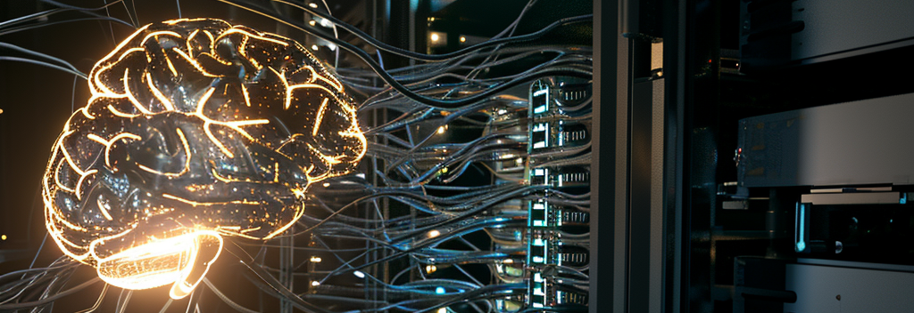

# Cerebro

The most cost-effective way to detect objects in your environment: Cerebro is a lightweight AI endpoint that runs in under a second and costs fractions of a fraction of a penny. **You can run it a THOUSAND times for only TWO cents!**

Powered by:

* [AWS SAM](https://aws.amazon.com/serverless/sam/): Automated deployment with a single command ([utils/Test.sh](utils/Test.sh)). Accessible anyime anywhere!

* [Microsoft ONNX Runtime](https://github.com/microsoft/onnxruntime): Accelerated CPU runtime. No expensive GPUs!

* [Ultralytics YOLOv8](https://github.com/ultralytics/ultralytics): Pretrained, general purpose detection model. Easily repurposed for your own use case!

## Quickstart

<details open>

<summary>Convenience script</summary>

```bash
# Format, Validate, Build, Test, Run
utils/Test.sh
```

</details>

<details>

<summary>Export more ONNX Models</summary>

```bash
# Use Docker convenience script if you dare
curl -fsSL https://get.docker.com -o get-docker.sh && sudo sh get-docker.sh
# Export nano model
utils/Export.sh
```

</details>

## Special thanks

* [davyneven](https://github.com/trainyolo/YOLOv8-aws-lambda) for his excellent AWS deployment tutorial.

### To-do

[ ] Bridge to Jetson platform
[ ] Training tutorial with Roboflow
